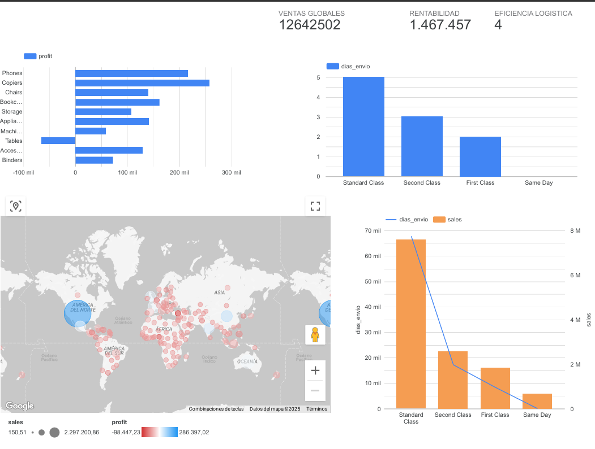

# ☁️ Global Supply Chain Analytics (GCP Pipeline)

## 📝 Sobre el Proyecto
Este proyecto simula un entorno de **Ingeniería de Datos Moderno** para una empresa de logística global. El objetivo fue migrar datos locales a la nube, transformarlos y visualizar pérdidas financieras en tiempo real.

## 🏗️ Arquitectura del Pipeline (Tech Stack)
Este proyecto no corre en local, sino en la arquitectura Cloud de Google:
1.  **Python (ETL):** Script de extracción y limpieza que normaliza fechas y estandariza nombres de columnas para compatibilidad con BigQuery.
2.  **Google BigQuery (Data Warehouse):** Almacenamiento y procesamiento de datos masivos.
    * *Técnica:* Uso de Vistas Materializadas y casting de tipos (`SAFE_CAST`) para asegurar integridad de datos.
3.  **Looker Studio (BI):** Conexión nativa a la nube para visualización geoespacial de rentabilidad.

## 🔍 Hallazgos Clave
* **Productos Críticos:** La subcategoría "Tables" (Mesas) representa la mayor fuga de capital, operando con márgenes negativos.
* **Logística:** El tiempo promedio de envío global es de 4 días. El servicio "Standard Class" llega a los 5 días, cumpliendo el SLA esperado.
* **Geografía:** Se detectaron mercados críticos en rojo (mapa de calor) que requieren intervención inmediata.

## 📸 Dashboard (Looker Studio)

---
*Proyecto de Ingeniería de Datos realizado por Geremy Hernandez
